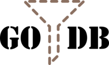
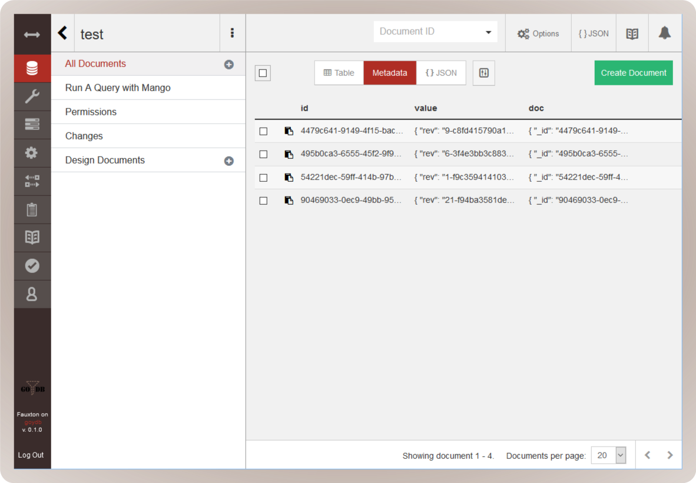

# 
 
goydb, a couchdb compatible embeddable database written in go

## Getting started (not embedded)

### Using docker

    mkdir data
    docker run -e GOYDB_ADMINS=admin:test -v data:/usr/local/var/goydb -p 7070:7070 goydb/goydb:latest

### From source (go get)

    go get github.com/goydb/goydb/cmd/goydb
    mkdir public
    mkdir dbs
    goydb

### From source (git)

    mkdir public
    mkdir dbs
    go run ./cmd/goydb

## Getting started with embedded version

```go
package main

import (
	"log"
	"net/http"

	"github.com/goydb/goydb/pkg/goydb"
)

func main() {
	// create new database default config
	cfg, err := goydb.NewConfig()
	if err != nil { 
		log.Fatal(err)
	}

	// create new database
	gdb, err := cfg.BuildDatabase()
	if err != nil {
		log.Fatal(err)
	}

	// expose http api
	err = http.ListenAndServe(cfg.ListenAddress, gdb.Handler)
	if err != nil {
		log.Fatal(err)
	}
}
```

## Fauxton UI



Add fauxton container to the router.

```go
import (
	"github.com/goydb/goydb/pkg/public"
	"github.com/goydb/utils"
)

...
cfg.Containers = []public.Container{
	utils.Fauxton{},
}
...
```

## Is this production-ready?

No.


See another example at the `cmd/goydb/main.go`.

## But why?

First, couchdb is awesome. This implementation is not aiming to replace
couchdb. It just another part of the ecosystem, similar to PouchDB.

The aim is to be able to build golang apps with integrated couchdb technology.
That means similar to pouchdb, integrate deeply with golang but enable sync to
couchdb.

Couchdb has the right principles at its heart:

* REST
* HTTP
* Map Reduce
* JSON
* Replication
* Attachments
* Mango

Things that are differert from couchdb:

* **Performance** due to direct access to the database using golang apis (**WIP**)
* **Attachment** not part of the strage but saved as regular files on disk (**WIP**)
* **Search** is part of the main storage using https://github.com/blevesearch/bleve (**planned**)

Things that I want to experiment with:

* **Validation / Schema**
  * Allow json schema based validation
* **HTTP**
  * Automatic OpenAPI specification
  * GraphQL support
  * Allow PATCH
  * Allow mango for update of documents
  * HTTP API for queues e.g. `/{db}/_queue/{msg}`
  * http vhost and proxies (https://github.com/goydb/vhost)
* **Rendering** via
  * go templates
  * jq
* **Formats** allow direct support for
  * yaml
  * bson
* **Backup**
  * PIT backup 
    * dump/restore via http
* **Instrumentation** first class metrics support
* **Security**
  * add document based security (see https://github.com/apache/couchdb/issues/1524)
  * full jwt and oauth2 support
