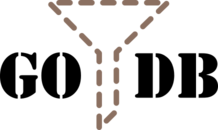
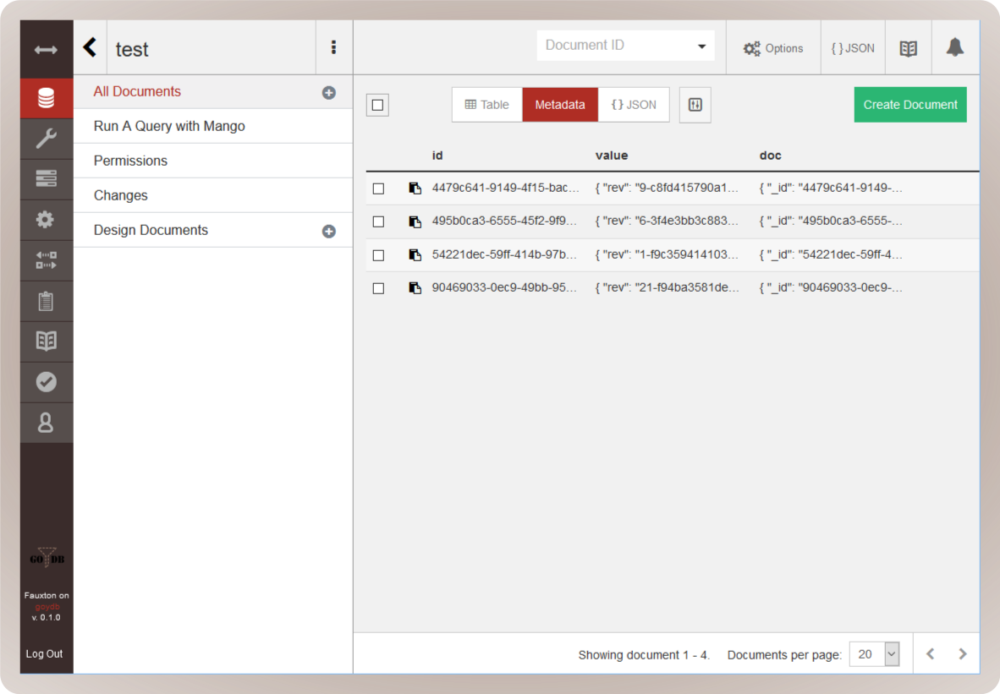

# 
 
goydb, a couchdb compatible embeddable database written in go

## Getting started (not embedded)

### Using docker

    mkdir data
    docker run -e GOYDB_ADMINS=admin:test -v data:/usr/local/var/goydb -p 7070:7070 ghcr.io/goydb/goydb:latest

### From source (go get)

    go get github.com/goydb/goydb/cmd/goydb
    mkdir public
    mkdir dbs
    goydb

### From source (git)

    mkdir public
    mkdir dbs
    go run ./cmd/goydb

## Getting started with embedded version

```go
package main

import (
	"log"
	"net/http"

	"github.com/goydb/goydb/pkg/goydb"
)

func main() {
	// create new database default config
	cfg, err := goydb.NewConfig()
	if err != nil { 
		log.Fatal(err)
	}

	// create new database
	gdb, err := cfg.BuildDatabase()
	if err != nil {
		log.Fatal(err)
	}

	// expose http api
	err = http.ListenAndServe(cfg.ListenAddress, gdb.Handler)
	if err != nil {
		log.Fatal(err)
	}
}
```

## Fauxton UI



Add fauxton container to the router.

```go
import (
	"github.com/goydb/goydb/pkg/public"
	"github.com/goydb/utils"
)

...
cfg.Containers = []public.Container{
	utils.Fauxton{},
}
...
```

## Adding custom HTTP routes

`Config.RouteHooks` lets embedding applications register their own HTTP
routes onto the same router/process `BuildDatabase` builds — no reverse
proxy or second server needed to serve a custom endpoint alongside goydb's
own CouchDB-compatible API. A hook receives the `*mux.Router` and the fully
built `*goydb.Goydb` (storage, config, logger), and runs after goydb's own
routes are registered, so it can't be shadowed by them.

```go
import (
	"net/http"

	"github.com/gorilla/mux"
	"github.com/goydb/goydb/pkg/goydb"
)

...
cfg.RouteHooks = append(cfg.RouteHooks, func(r *mux.Router, gdb *goydb.Goydb) error {
	r.Methods("GET").Path("/_myapp/health").HandlerFunc(func(w http.ResponseWriter, _ *http.Request) {
		w.WriteHeader(http.StatusOK)
	})
	return nil
})
...
```

## Is this production-ready?

goydb is under active development and hasn't seen the years of hardening that
CouchDB has. It's used for embedding couchdb-like functionality directly into
Go applications, not as a drop-in CouchDB replacement.

Most of the CouchDB HTTP API is implemented, including document CRUD,
attachments, views, Mango queries, full-text search, and replication with
multi-revision conflict support. The main gaps are design document functions
(`_show`, `_list`, `_update`, `_rewrite`) and CouchDB's newer Nouveau search
engine — see the [compatibility matrix](docs/compatibility.md) for details.

If you're relying on it for data you can't afford to lose, set up replication
to a regular CouchDB instance as a durability backstop — goydb speaks the
CouchDB replication protocol, so this works the same way multi-master
CouchDB replication does.

See another example at the `cmd/goydb/main.go`.

## Build tags

By default goydb builds with goja (JS views), tengo, bleve full-text search,
JWT auth, and TOTP all included; each can be excluded to shrink the binary
with its own negative tag (`-tags nogoja,notengo,nosearch,nojwt,nototp`, in
any combination).

The storage engine is the opposite: bbolt is always built in, and SQLite is
an opt-in addition, enabled with `-tags sqlite`:

    go build -tags sqlite ./cmd/goydb

The official `ghcr.io/goydb/goydb` Docker image is built with `-tags sqlite`,
so both engines are available out of the box when using it.

This doesn't replace bbolt — a `-tags sqlite` binary can open and create
databases with either engine, chosen per database. `PUT /{db}` picks the
engine via an `?engine=bbolt|sqlite` query parameter (same idea as CouchDB's
own per-database engine selection), falling back to the `couchdb/default_engine`
runtime-config value, and finally to `bbolt` if neither is set. See
[Configuration Reference](docs/config.md#choosing-a-storage-engine-per-database)
for details.

SQLite databases are stored as `<name>.sqlite3`, distinct from the default
bbolt files (which have no extension), so both kinds of files can coexist in
the same `dbs` directory — each is always reopened with the engine that
actually wrote it, regardless of the current default. A binary built
*without* `-tags sqlite` only has the `bbolt` engine available; it refuses
`?engine=sqlite` (`400 Bad Request`), and a `.sqlite3` file present in its
`dbs` directory doesn't stop the server from starting or affect any other
database — that one database is reported as unavailable (it still appears
in `_all_dbs`/Fauxton; any request against it gets a clear "database exists
but could not be opened" error) until it's deleted or opened with a binary
that has `-tags sqlite`.

The SQLite engine's connection-pool behavior (how many concurrent readers,
how long idle connections are kept) is tunable via the `sqlite` section of
the [runtime config](docs/config.md#section-sqlite) — `GET`/`PUT
/_config/sqlite/{key}`, same mechanism as every other `_config` section.

## Replication

Besides the built-in CouchDB-compatible `/_replicate` HTTP endpoint, the
replication engine is also exposed as a standalone Go API via
[`pkg/replication`](pkg/replication) and [`pkg/replicator`](pkg/replicator),
so external code can drive goydb's checkpoint-based pull/push protocol
directly, without going through HTTP:

```go
import (
	"github.com/goydb/goydb/pkg/goydb"
	"github.com/goydb/goydb/pkg/replication"
	"github.com/goydb/goydb/pkg/replicator"
)

cfg, err := goydb.NewConfig()
// ...
gdb, err := cfg.BuildDatabase() // *goydb.Goydb satisfies port.Storage

r := &replicator.Replicator{
	Source:     &replication.LocalDB{Storage: gdb, DBName: "source"},
	Target:     &replication.LocalDB{Storage: gdb, DBName: "target"},
	Continuous: true, // keep polling and replicating until ctx is cancelled
}
_, err = r.Run(ctx)
```

Both `Source` and `Target` only need to satisfy `port.ReplicationPeer`, so a
`replication.RemoteClient` (talking to any CouchDB-compatible server over
HTTP) can be mixed with a `replication.LocalDB` on either side. With
`Continuous: false` (the default), `Run` returns once the target has caught
up; with `Continuous: true` it keeps polling for new changes and only
returns when `ctx` is cancelled — same as CouchDB's own continuous
replication mode.

## Documentation

* [Configuration Reference](docs/config.md)
* [CouchDB API Compatibility Matrix](docs/compatibility.md)
* [Architecture](docs/architecture.md)

## But why?

First, couchdb is awesome. This implementation is not aiming to replace
couchdb. It just another part of the ecosystem, similar to PouchDB.

The aim is to be able to build golang apps with integrated couchdb technology.
That means similar to pouchdb, integrate deeply with golang but enable sync to
couchdb.

Couchdb has the right principles at its heart:

* REST
* HTTP
* Map Reduce
* JSON
* Replication
* Attachments
* Mango

Things that are differert from couchdb:

* **Performance** due to direct access to the database using golang apis (**WIP**)
* **Attachment** not part of the document storage but saved as regular files on disk next to the documents (**WIP**)
* **Search** is part of the main storage using https://github.com/blevesearch/bleve (**WIP**)

Things that I want to experiment with:

* **Validation / Schema**
  * Allow json schema based validation
* **HTTP**
  * Automatic OpenAPI specification
  * GraphQL support
  * Allow PATCH
  * Allow mango for update of documents
  * HTTP API for queues e.g. `/{db}/_queue/{msg}`
  * http vhost and proxies (https://github.com/goydb/vhost)
* **Rendering** via
  * go templates
  * jq
* **Formats** allow direct support for
  * yaml
  * bson
* **Backup**
  * PIT backup 
    * dump/restore via http
* **Instrumentation** first class metrics support
* **Security**
  * add document based security (see https://github.com/apache/couchdb/issues/1524)
  * full jwt and oauth2 support
