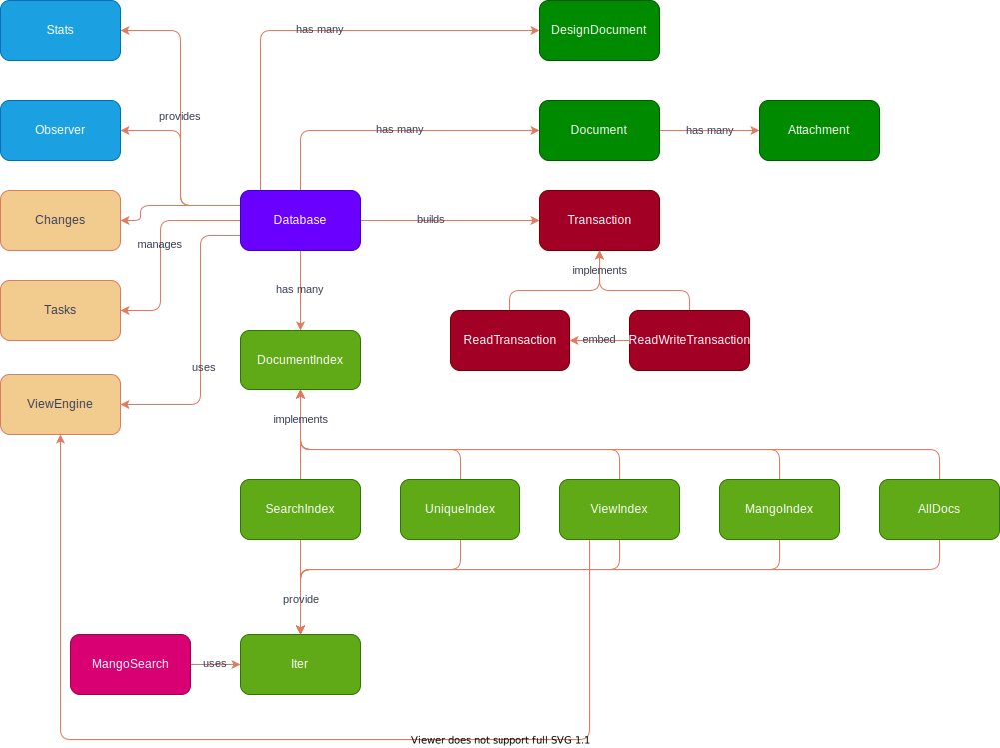

# Architecture

The above drawing doesn't reflect the current architecture but a future one.

Currently the main index structures are managed on change. This reduces the memory
footprint of the application but makes working with the indices hard.
Caching and cache invalidation are rather complicated.

Ideas for improvement

* Load all design documents at start and create respective index container structs
* On document update, update all index containers using a single simple api `DocumentIndex`
* The `FindDocs` will be moved to `MangoSearch` which can be executed on all iterators
  * This is even an improvement to couchdb where the mango query can only be executed
    on mango indices and AllDocs
* A database becomes a folder and every index can change files on disk
* Each index can an should maintain stats (via the interface)
* The ViewEngine should be created when the design document is changes and then
  kept in memory to reduce latency.
* An index is either an async or sync index (configured)
  * A sync index performs updates to the index within the same transaction as the document write
  * An async index will perform updates with an async task. With an async task a copy of the document
    is created on which all indexes that are async are executed.
